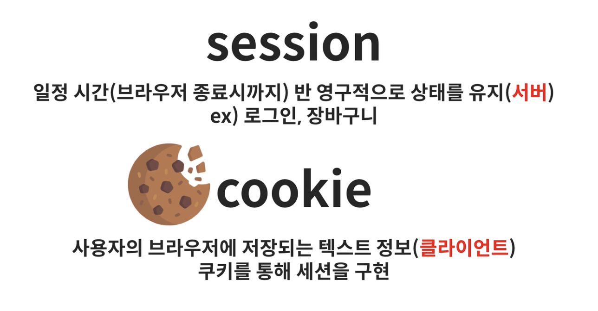
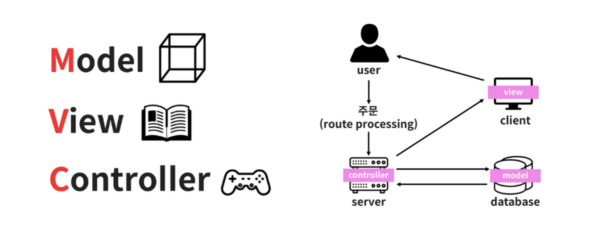

# BackEnd
  - 쿠키와 세션
  - RESTFul API 란?
  - MVC 패턴이란 무엇인가?
  - DI(Dependency Injection)
  - AOP(Aspect Oriented Programming)
  - Connection pool
  - Spring Franmework 특징
  - JSP(Java Server Page)
  - JSP에서 페이지 이동 방식
    - Forward
    - Redirect
  - Servlet
  - WAS(Web Application Server)
  - 웹컨테이너

    

# 쿠키와 세션

> \- HTTP 프로토콜은 상태 유지가 되지 않는 프로토콜이다. 
\- 웹 브라우저(클라이언트)의 요청에 대한 응답을 하고 나면 해당 클라이언트와의 연결을 지속하지 않음 
\- 로그인을 하고 서비스를 이용하는 경우, 서비스를 클릭해서 이동할 때 마다 전부 로그인을 다시 해야함 

 

**쿠키(Cookie)**
- 사용자의 컴퓨터에 저장
- 저장된 정보를 다른 사람 또는 시스템이 볼 수 있다는 단점
- 유효시간이 지나면 사라짐
- 사이트에 접속했을 때, '아이디와 비밀번호를 저장하시겠습니까?' 라고 물어보는 것은 쿠키를 저장하겠느냐는 뜻이다

**쿠키의 원리**
1. 클라이언트가 브라우저에 요청
2. 브라우저는 쿠키를 생성하여 클라이언트에게 응답을 해줌
3. 클라이언트 재 방문시 웹페이지 요청과 함께 쿠키값도 전송

---

**세션(Session)**
- 서버에 저장
- 서버가 종료되거나 유효시간이 지나면 사라짐

**세션의 원리**
1. 클라이언트가 브라우저에 요청
2. 브라우저는 세션ID를 생성하고 세션ID를 이용한 저장소 생성
3. 세선ID를 담은 쿠키를 생성하여 클라이언트에게 응답을 해줌
4. 클라이언트 재 방문시 이 쿠키를 이용하여 세션ID값을 서버에 전달함

 

# RESTFul API 란?

 

# MVC 패턴이란 무엇인가?

> 디자인 패턴 중 하나인 MVC 패턴

> 디자인 패턴이란, 프로그램을 개발하는 중에 발생했던 문제점들을 정리해서 간편하게 적용하여 쓸 수 있는 것을 정리한 형태를 말한다

 

- Model : 백그라운드에서 동작하는 로직을 처리
- View : 사용자가 보게 될 결과화면 출력
- Controller : 사용자의 입력처리와 흐름 제어를 담당

**모델(Model)**
- 사용자가 편집하길 원하는 모든 데이터를 가지고 있어야 한다
- 뷰나 컨트롤러에 대해서 어떤 정보도 알지 말아야 한다

**뷰(View)**
- 모델이 가지고 있는 정보를 따로 저장해서는 안된다
- 모델이나 컨트롤러와 같이 다른 구성요소들을 몰라야 된다

**컨트롤러(Controller)**
- 데이터와 인터페이스 요소들을 잇는 다리역할 즉, 사용자가 데이터를 클릭하고 수정하는 것에 대한 이벤트를 처리하는 부분
- 모델이나 뷰에 대해서 알고 있어야 한다
- 모델이나 뷰의 변경을 모니터링 해야한다

> 서로 분리되어 각자의 역할에 집중할 수 있게끔하여 개발을 하고 그렇게 애플리케이션을 만든다면 유지보수성, 확장성, 유연성이 증가하고 중복코딩의 문제를 해결 할 수 있다

 

# DI(Dependency Injection)

> 프로그래밍에서 구성요소간의 의존 관계가 소스코드 내부가 아닌 외부의 설정파일 등을 통해 정의되게 하는 디자인 패턴 중의 하나이다

> ✅ 의존성 주입의 이점 
\- 의존 관계 설정이 컴파일시가 아닌 실행시에 이루어져 모듈간의 결합도를 낮출 수 있다
\- 코드 재사용을 높여서 작성된 모듈을 여러 곳에서 소스코드의 수정 없이 사용할 수 있다

**의존성 주입**

 

# AOP(Aspect Oriented Programming)