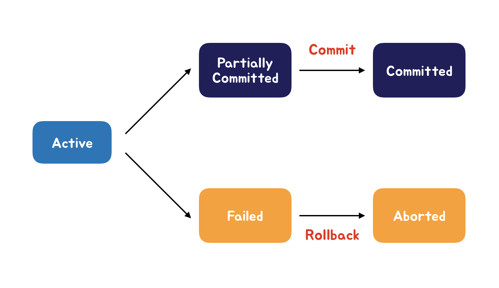

# Database
  - 키(Key)의 종류와 개념
  - 데이터베이스 무결성(Integrity)
  - 데이터 이상(Anomaly)
  - 정규화(Normalization)
  - 트랜잭션(Transaction)과 ACID
  - 병행제어(Concurrency Control)
  - 조인(Join)
  - 인덱스(Index)
  - NoSQL과 RDBMS

    

# 키(Key)의 종류와 개념

**슈퍼키(Super Key)**
- 한 릴레이션 내에 있는 속성들의 집합으로 구성된 키
- 유일성은 만족하지만, 최소성은 만족하지 못함
- 최소성을 만족시키지 못한다는 것은 만약 '학번, 주민번호, 성명'으로 이뤄진 슈퍼키가 있다고 했을때, 이 키를 통해 다른 튜플과 구별이 가능하지만, '성명'을 단독적으로 슈퍼키로 사용한다면 튜플을 구별할 수 없기 때문에 최소성을 만족시키지 못한다.

**후보키(Candidate Key)**
- 속성들 중에서 튜플을 유일하게 식별할 수 있는 속성들의 부분집합
- 모든 릴레이션은 반드시 하나 이상의 호보키를 가져야함
- 모든 튜플에 대해 유일성과 최소성을 모두 만족시켜야함

**기본키(Primary Key)**
- 후보키 중에서 선정된 키
- 특정 튜플을 유일하게 구별할 수 있는 속성
- NULL값을 가질 수 없고, 동일한 값이 중복되어 저장될 수 없음(개체 무결성 조건)

**대체키(Alternate Key)**
- 기본키에 선정되지 못한 후보키
- 보조키라고도 함

**외래키(Foreign Key)**
- 릴레이션 R1,R2에서 릴레이션 R1이 참조하고 있는 릴레이션 R2의 기본키와 같은 R1의 속성
- 참조되는 릴레이션의 기본키와 대응되어 릴레이션 간에 참조 관계를 표현(도메인이 동일)
- 외래키로 지정되면 참조 테이블의 기본키에 없는 값은 입력 불가(참조 무결성 조건)
- NULL값을 가질 수 있음

 

# 데이터베이스 무결성

> 데이터의 무결성은 데이터의 정확성, 일관성, 유효성이 유지되는 것을 말한다.

**개체 무결성(Entity Integrity)**
- 모든 릴레이션은 기본키로 선택된 속성을 가져야한다
- 기본키를 구성하는 속성은 NULL값이나 중복값을 가질 수 없다

**참조 무결성(Entity Integrity)**
- 외래키 값은 NULL이거나 참조 릴레이션의 기본키 값과 동일해야 한다
- 즉, 릴레이션은 참조할 수 없는 외래키 값을 가질 수 없다

**도메인 무결성(Entity Integrity)**
- 특정 속성의 값이 그 속성의 도메인에 존재하는 값만 가질 수 있음

 

# 데이터 이상(Data Anomaly)

> 테이블에서 일부 속성들의 종속으로 인해 데이터들의 중복이 발생하여 조작할 수 없는 현상

**삽입 이상**
- 테이블에 데이터를 삽일할 때, 원하지 않는 값들로 인해 생기는 이상
> <수강> 테이블에 학번이 '600'인 학생의 학번만 입력하고 싶은 경우

**삭제 이상**
- 데이블에 한 튜플을 삭제할 때, 원하지 않는 값 또한 삭제되어 생기는 이상
> 연쇄삭제 문제

**갱신 이상**
- 테이블에서 튜플에 있는 속성 값을 갱신할 때, 다른 튜플의 값은 갱신되지 않아 생기는 이상
> 정보의 불일치성

 

# 정규화(Normalization)

> 테이블을 무손실 분해하는 과정 
  가능한 한 중복을 제거하여 이상(Anomaly) 발생가능성을 줄이는 것이 목적

**제 1정규형**
- 모든 속성의 도메인이 원자값만으로 되어있는 정규형
> 도메인(Domain) : 하나의 속성이 갖는 값들의 집합

**제 2정규형**
- 기본키가 아닌 모든 속성이 기본키에 대해 완전 함수 종속을 만족하는 정규형
> ✅ 완전 함수 종속 
  \- 어떤 속성이 기본키에 대해 완전히 종속일 때
    
  ✅ 부분 함수 종속 
  \- 어떤 속성이 기본키의 일부에 의해서도 종속일 때

**제 3정규형**
- 기본키가 아닌 모든 속성이 기본키에 대해 이행적 함수 종속을 만족하지 않는 정규형
> ✅ 이행적 함수 종속 
  \- 세가지 종속간의 종속이 'A→B', 'B→C'경우 'A→C'가 성립되는 종속

**BCNF**
- 모든 결정자가 후보키인 정규형

 

# 트랜잭션(Transaction)과 ACID

**트랜잭션(Transaction)**
- 하나의 논리적 기능을 수행하기 위한 일련의 연산집합으로 작업의 단위

> ✅ COMMIT 
  \- 트랜잭션이 정상적으로 종료되어 변경내용을 데이터베이스에 반영하는 연산

> ✅ ROLLBACK 
  \- 트랜잭션이 비정상적으로 종료되어 일관성이 깨졌을 때, 모든 작업을 취소하고 이전으로 돌리는 연산

**ACID**

- Atomicity(원자성)
  - 트랜잭션의 연산은 데이터베이스에 모두 반영되던가 모두 반영되지 않아야함

- Consistency(일관성)
  - 트랜잭션 수행이 완료되면 언제나 일관성 있는 데이터베이스 상태로 변환
  - 트랜잭션 수행 전과 수행 후의 일관성 유지

- Isolation(독립성)
  - 한 트랜잭션이 완료되기 전까지는 다른 트랜잭션이 갱신 중인 데이터에 접근할 수 없음
  - 여러 트랜잭션이 수행되더라도, 결과는 순차적이어야함

- Durability(영속성)
  - 트랜잭션 작업이 완료됐다면, 결과는 영구적으로 반영되어야함

 

# 병행제어(Concurrency Control)

> 동시에 여러 트랜잭션을 병행 수행할 때, 트랜잭션들이 일관성을 파괴하지 않도록 제어하는 기술

**LOCKING 기법**
- 데이터베이스 관리에서 하나의 트랜잭션에서 LOCK을 걸어 사용되는 데이터를 다른 트랜잭션이 접근하지 못하게 하는 것

> ✅ 2단계 Locking 기법 
\- 트랜잭션 스케줄의 직렬성을 보장하는 기법
 
\- 확장(Growing) 단계 : Lock을 획득하는 단계, 가지고 있는 Lock 해지X
\- 수축(Shrinking) 단계 : Lock을 해제하는 단계, 새로운 Lock 획득X
 
\# 교착상태(Deadlock)를 예방하지는 못함
 
📛 교착상태(Deadlock) : 트랜잭션들이 서로의 자원을 획득하려고 대기함으로, 무한대기 상태에 빠지는 상태

> ✅ 타임스탬프 순서 기법 
\- 시스템이 각 트랜잭션을 실행할 때, 타임스탬프를 부여
\- 트랜잭션 간의 실행 순서를 미리 결정함
 
\# 교착상태(Deadlock)를 예방
