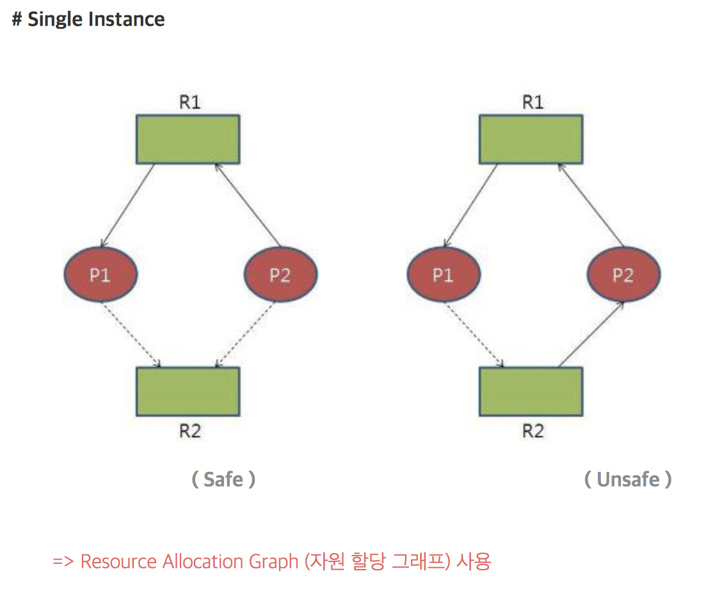
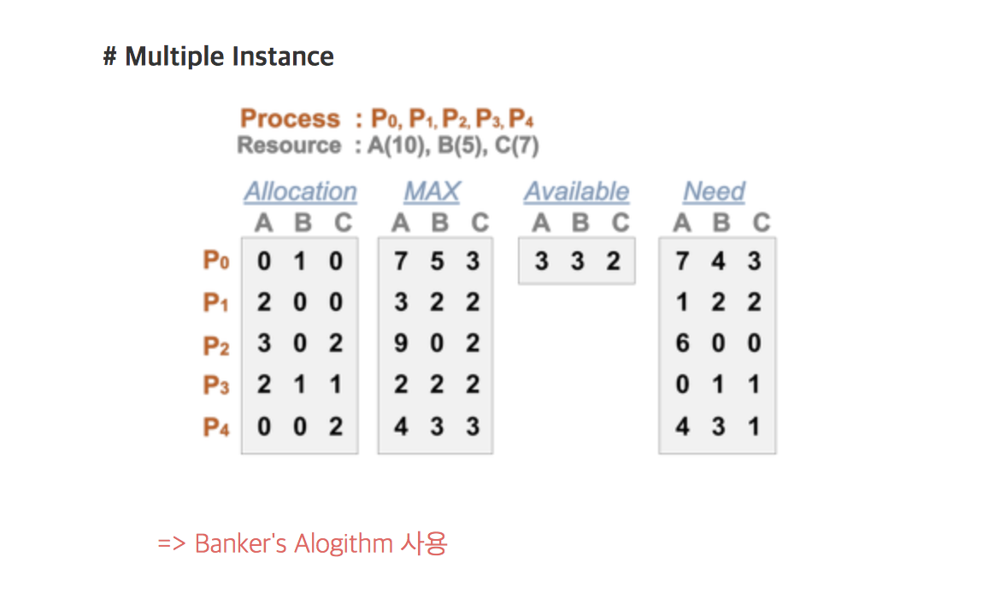

# 운영체제
  - [Process와 Thread의 차이](#process와-thread의-차이)
    - Benefits of Threads
  - [Multi Programming, Multi Processing, Multi Threading의 차이](#multi-programming,-multi-processing,-multi-threading의-차이)
  - [인터럽트(Interrupt)](#인터럽트(interrupt))
    - System Call
    - Interrupt Call
  - [스케줄러의 종류](#스케줄러의-종류)
    - 장기 스케줄러
    - 단기 스케줄러
    - 중기 스케줄러
  - [CPU 스케줄러](#cpu-스케줄러)
    - FCFS(First Come First Served)
    - SJF(Shortest Job First)
    - SRT
    - Priority Scheduling
    - RR(Round Robin)
  - [Synchronous / Asynchronous](#synchronous-/-asynchronous)
  - [프로세스 동기화(Synchronization)](#프로세스-동기화(synchronization))
    - Race Condition
    - Critical Section
  - [동기화 해결책](#동기화-해결책)
    - 세마포어(Semaphore)
    - 모니터(Monitor)
    - 뮤텍스(Mutex)
  - [데드락(Deadlock)](#데드락(deadlock))
    - 발생조건
    - 처리방법
      - Deadlock Prevention
      - Deadlock Avoidance
      - Deadlock Detection and Recovery
      - Deadlock Ignorance
  - [Page Replacement](#page-replacement)
    - Optimal Algorithm
    - FIFO(First In First Out)
    - LRU(Least Recently Used)
    - LFU(Least Frequency Used)
    - Clock Algorithm(LRU Approximation Algorithm)
  - [가상메모리](#가상메모리)
    - 배경
    - 가상 메모리가 하는일

  

# Process와 Thread의 차이

**프로세스(Process)**
>Process is a program in execution

>A Thread is a unit of CPU utilization

즉, 프로세스는 현재 사용중인 프로그램을 의미하고,  
스레드는 하나의 프로세스 내에서 생성되는 실행 주체이다.

**Benefits of Threads**
- Responsiveness
- Resource Sharing
- Economy
- Utilization of MP(Multi Processor) Architectures

# Multi Programming, Multi Processing, Multi Threading의 차이?

**Multi Programming**
- 하나의 프로세스에서 다른 프로세스로 CPU 제어권이 넘어감으로 여러 프로그램을 교대로 수행함
- Interactive한 방식

**Multi Processing**
- 1개 이상의 프로세서가 협력하여 작업을 처리함
- 여러 프로세서가 작업을 병렬처리함

**Multi Threading**
- 프로세스는 IPC(InterProcess Communication)을 통해 자원을 공유함
- 하지만 스레드는 하나의 공유메모리를 사용하여 자원을 공유함

# 인터럽트(Interrupt)

> 프로그램을 수행하는 도중에 예기치 않은 상황이 발생 
  Register와 PC(Program Counter)를 저장한 후, CPU 제어권을 인터럽트 처리 루틴에 넘겨줌

**인터럽트 종류**
- H/W 인터럽트 (Interrupt) : Timer, I/o
- S/W 인터럽트 (Trap) : System Call, Exception

**Interrupt Call**
- Timer Interrupt : CPU가 한 프로세스가 독점하여 차지하는 것을 방지
- I/O Interrupt : I/O작업을 요청하는 Interrupt

**System Call**
- 사용자 프로그램이 S/W적으로 Inerrupt를 요청
- 사용자 프로그램은 직접 O/S에 직접 요청을 할 수 없음
- Mode bit(0 : Kernel mode , 1 : User mode) 가 1인 경우 System call을 통해 mode bit를 0으로 만듬

# 스케줄러의 종류

**문맥교환 (Context Switch)**
- CPU를 한 프로세스에서 다른 프로세스로 넘겨주는 과정
- CPU 제어권을 넘겨줄 때 프로세스의 상태를 PCB에 저장함
- PCB(Process Control Block) : OS가 프로세스들을 관리하기 위해 각 프로세스당 유지하는 정보

**프로세스를 스케줄링하기 위한 큐**
- Job Queue : 현재 시스템 내에 있는 모든 프로세스의 집합
- Ready Queue : 현재 메모리 내에 있으면서 CPU를 얻어서 실행되기를 기다리는 프로세스의 집합
- Device Queue : I/O 처리를 기다리는 프로세스의 집합

**장기 스케줄러 (Long-term Scheduler, Job Scheduler)**
- 시작 프로세스 중에서 어떤 것을 Ready Queue로 보낼지 결정하는 스케줄러
- 프로세스에 Memory를 주는 문제
- 시분할에서는 장기 스케줄러가 없음 (모든 프로세스가 Ready Queue로 보내짐)

**단기 스케줄러 (Short-term Scheduler, CPU Scheduler)**
- 어떤 프로세스에게 CPU를 줄 것인가 결정하는 스케줄러
- 충분히 빨라야함!

**장기 스케줄러 (Medium-term Scheduler, Swapper)**
- 여유 공간을 마련하기 위해 프로세스를 통째로 메모리에서 디스크로 쫓아냄
- 프로세스에게서 Memory를 뺏는 문제

# CPU 스케줄러

**FCFS**
- 프로세스의 도착 순서에 따라 스케줄링
- Convoy Effect(Short Process가 오래 기다림) 문제 발생

**SJF**
- 실행시간이 가장 짧은 프로세스부터 스케줄링

**SRT**
- 현재 수행중인 프로세스의 남은 burst time보다 짧은 프로세스가 도착하면 CPU를 넘겨줌
- Starvation(Preemption의 경우 Long Process가 무한히 기다림) 문제 발생

**Priority Scheduling**
- SJF는 일종의 우선순위 스케줄링
- Aging으로 Starvation 문제를 해결
> Aging :  As time progresses increase the priority of the process.

**RR(Round Robin)**
- Time Quantum(할당 시간)을 가짐
- 할당 시간이 끝나면 CPU를 Preemption 당하고 Ready Queue로 이동
- 할당시간이 크면 FCFS
- 할당시간이 작으면 Overhead 증가

# Synchronous / Asynchronous

# 프로세스 동기화(Synchronization)

**Race Condition**
- 여러 프로세스들이 동시에 공유데이터에 접근하면 일관성(Consistency) 문제 발생
- race condition을 막기 위해서 Concurrent Process는 동기화(Synchronize)되어야 한다!

**Critical Sectoin**
- 각 Process의 Code 에서 공유데이터에 접근하는 Section

# 동기화 해결책

**세마포어(Semaphore)**

**모니터(Monitor)**

**뮤텍스(Mutex)**

# 데드락(Deadlock)

**발생 조건**
- Mutual Exclusion(상호 배제)
- No Preemption(비선점)
- Hold and Wait(점유 대기)
- Circular Wait(순환 대기)

**해결 방법**
- Deadlock Prevention
    : 자원 할당 시, 데드락 발생 조건 중 하나라도 만족되지 않게 하는 것
  -  Preemption (Save&Restore 가능한 자원에서 사용)
  - Request all resources Initially (프로세스 시작 시 모든 자원을 할당)
  - 자원이 필요한 경우 보유 자원을 놓음
  - Order resources numerically (할당 순서를 정하여 정해진 순서대로만 자원할당)
- Deadlock Avoidance
  - 자원 요청에 대한 부가적인 정보를 이용해서 deadlock의 가능성이 없는 경우에만 자원할당
  - 프로세스들이 필요로 하는 각 자원별 최대 사용량을 미리 선언

  <!-- -  -->
  <!-- -  -->

- Deadlock Detection & Recovery
  : 데드락을 탐색하고 복구하는 방법
  - Recovery 1. Process Termination
    - 프로세스를 종료한다
  - Recovery 2. Resource Preemption
    - 비용을 최소화할 Victim Process를 선정하여 자원을 선점한다

- Deadlock Ignore
  - Deadlock이 일어나지 않을 것을 가정하고 아무런 조치를 취하지 않는다
  - 만약 발생 시, 사용자가 직접 프로세스를 죽이는 방법으로 대처한다

# Page Replacement

# 가상메모리

